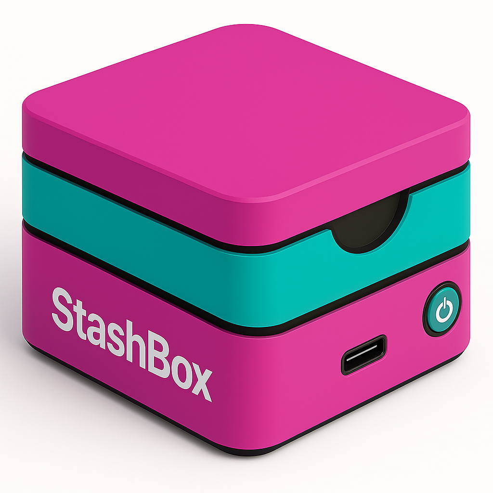
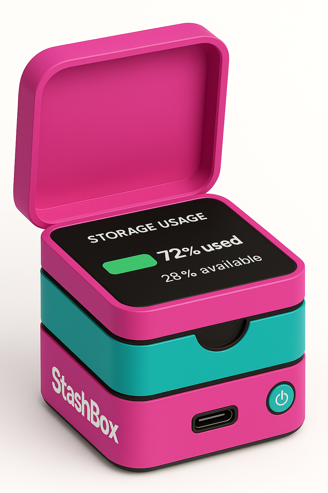

# 📦 StashBox

  
  
  

**StashBox** is a theoretical hardware companion to the Stash file organization system. While the original `stash` 
is a Python-based tool for automatically sorting files into folders based on customizable rules, **StashBox** 
imagines a physical embodiment of that concept — a smart, minimalist storage device that stashes your digital clutter 
in the real world.

**StashBox** is part of the _Stash Ecosystem_ that includes:
- [Stash](https://github.com/trevortomesh/stash)
- [deepstash](https://github.com/trevortomesh/deep-stash)
- [StashBox](https://github.com/trevortomesh/stash-box)

> ⚠️ This project is **currently theoretical** and serves as a conceptual prototype for future development.

---

## 🧠 Concept

StashBox is designed to act as a **physical interface for digital organization**.

Imagine a small, pastel-colored cube (inspired by the Stash logo) that sits on your desk:
- You plug it in via **USB-C**.
- It shows a real-time **dashboard** of your stashed files.
- It **automatically sorts** anything dropped into it based on `.ds` rules (Deepstash format).
- It communicates with your local machine or the cloud.

---

## ✨ Key Features (Conceptual)

- **Interactive Display**: Shows live sorting stats, usage graphs, and disk space remaining (e.g., pie charts).
- **Onboard Storage**: Files dropped into the box are stashed and sorted automatically.
- **Rule-Based Sorting**: Uses `.ds` rule files or syncs from a host machine.
- **Encrypted Vault Mode**: Optionally stash files in an encrypted format.
- **Tactile Feedback**: Light, sound, or motion to confirm successful stashing.
- **USB-C + Wi-Fi Ready**: For power and/or wireless sync.

---

## 💡 Example Use Case

You connect the StashBox to your Mac via USB-C. On your computer, you see it appear as a folder called `StashBox/`. As you drag files into it:
- `.png` files are moved to `Images/`
- `.pdf` files are moved to `Documents/`
- New file types prompt the device (or software) to ask where to sort them

On the device’s display, a small pie chart shows:

🔘 58% Full
📂 42% Free Space

---

## 🛠️ Implementation Ideas (Future)

- **Hardware**:
    - Raspberry Pi Zero 2 W or similar
    - 64GB+ flash storage
    - Capacitive touch interface or small OLED screen
    - RGB LED status ring

- **Software**:
    - Embedded Python backend using `stash`
    - Local web dashboard for remote rule editing
    - `.ds` rule format to allow syncing/scripting of logic

- **Enclosure**:
    - Pastel-themed cube with layered bands (magenta + teal)
    - Designed to visually match the Stash identity

---

## 📁 Project Structure (Planned)

stashbox/
├── firmware/           # Embedded Python + Linux scripts
├── enclosure/          # 3D models for case
├── assets/             # Logos, renders, and mockups
├── prototype/          # Raspberry Pi setup files
└── README.md

---

## 📷 Visual Mockups

Mockups are available in the `assets/` folder, showcasing different views of the StashBox with potential display modes and housing designs.

---

## 🧪 Status

- ✅ Logo and visual identity complete
- ✅ Theoretical hardware specs and design documented
- 🧪 Software & firmware not implemented yet
- 🛠️ Physical prototype not yet built

---

## 📜 License

This project is licensed under the MIT License.

---

## 🙋‍♀️ Contributing

Have ideas? Want to help build it?

Please [open an issue](https://github.com/trevortomesh/stash-box/issues) or start a discussion. We’re in early conceptual stages and welcome creative collaborators — especially those with experience in embedded systems, 3D printing, or desktop software development.

---

## 💬 Contact

Made with ✨ and cluttered desktops by Trevor Tomesh.

Questions? Reach out via GitHub or email me at [tmtomesh@hotmail.com](mailto:tmtomesh@hotmail.com).
